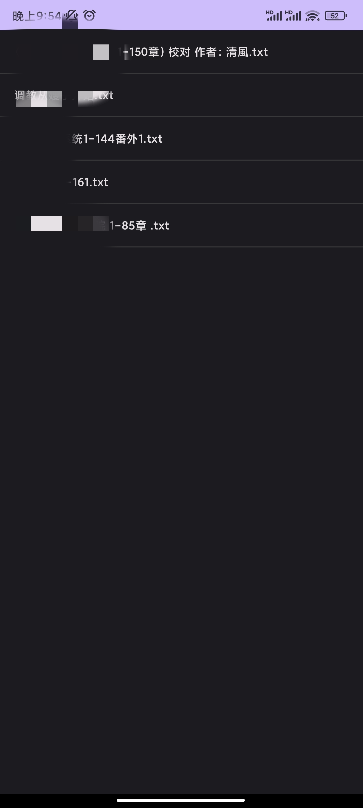
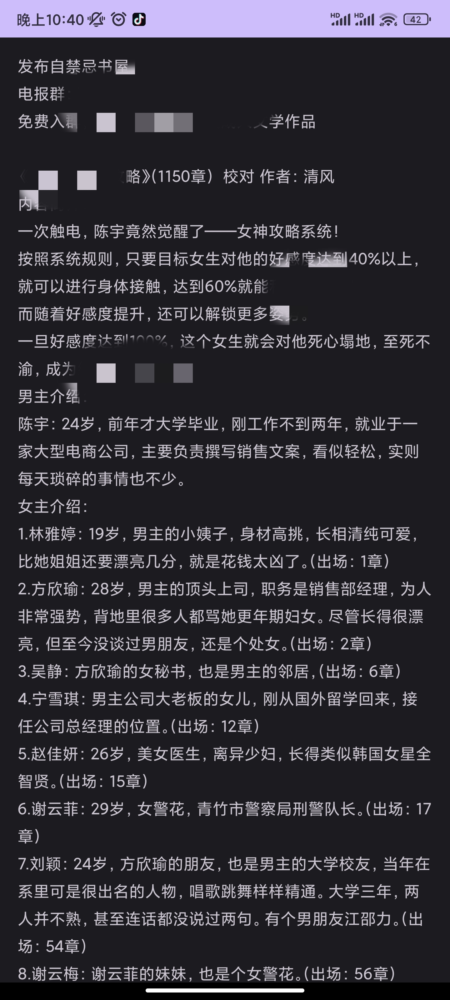

# Platinum Reader 📖
写来随便玩的一款本地TXT小说阅读的Android应用，无广告、不联网。因为自己一般都是网上下载资源需要一个直接导入没有广告的干净app。

## **功能特点**
- **本地阅读**：目前仅支持TXT格式。
- **简洁界面**：[✅]。
- **书架管理**：[✅]。
- **自定义阅读**：[❌]后期计划。
- **书签功能**：[❌]后期计划。
- **在线阅读**：[❌]后期计划爬去笔趣阁数据源。

## **安装指南**
1. 从GitHub下载最新的APK文件：[Releases](https://github.com/changmen1/Platinum/releases)
2. 在手机设置中允许安装未知来源应用。
3. 点击APK文件进行安装。

## **界面预览**

## **技术特性**
- **基于Android原生开发**：稳定性高。
- **轻量级应用**：安装包体积小，占用资源少。
- **开源代码**：欢迎贡献代码或提出建议！

## **贡献与反馈**
- 如有问题或建议，请提交[Issues](https://github.com/changmen1/Platinum/issues)。
- 欢迎Fork项目并提交Pull Requests参与开发！

## **许可证**
本项目采用[MIT许可证](https://github.com/changmen1/Platinum/blob/main/LICENSE)。

## **关于作者**
- GitHub：[changmen1](https://github.com/changmen1)
